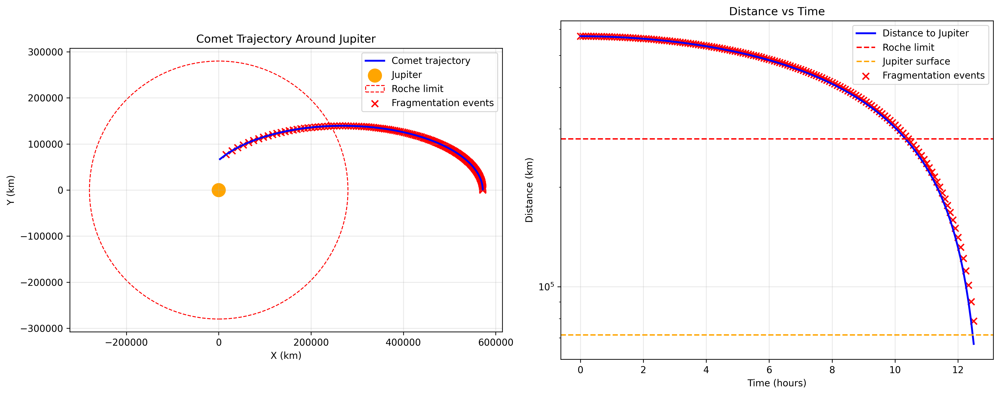

# 🌌 Comet Fragmentation Simulator

[](https://www.python.org/downloads/)
[](https://opensource.org/licenses/MIT)
[](https://github.com/yourusername/comet-fragmentation-simulator/stargazers)

A comprehensive physics-based simulation system for modeling comet fragmentation events, featuring the famous **Shoemaker-Levy 9** case study.



## 🎯 Overview

This project simulates the complex astrophysical dynamics of comet breakup events, including:

- **🌊 Tidal Forces**: Roche limit calculations and gravitational disruption
- **🔥 Thermal Stress**: Solar heating and internal pressure buildup  
- **💨 Gas Pressure**: Sublimation-driven fragmentation forces
- **🎯 N-body Dynamics**: Multi-body gravitational interactions
- **📊 Comprehensive Analysis**: Real-time visualization and reporting

## 🔬 Scientific Foundation

Based on peer-reviewed astrophysics research and implements:

- **Roche Limit Theory**: Critical distance calculations for tidal disruption
- **Thermal Dynamics**: Solar heating effects and thermal expansion stress
- **Gas Pressure Models**: Sublimation rates and internal pressure forces
- **Material Science**: Realistic comet composition and structural properties
- **Celestial Mechanics**: Accurate orbital dynamics and perturbations

## ✨ Key Features

### 🚀 Physics Engine
- **Enhanced Force Models**: Thermal, gas pressure, and tidal forces
- **Realistic Stress Analysis**: Material strength vs. applied stresses
- **Adaptive Time-stepping**: Numerical stability and accuracy
- **Energy Conservation**: Physical validation and error tracking

### 🪐 Comet Modeling
- **Realistic Composition**: Ice, rock, and dust fraction modeling
- **Structural Integrity**: Material strength and failure analysis
- **Dynamic Fragmentation**: Real-time breakup event detection
- **Fragment Evolution**: Post-breakup trajectory tracking

### 📈 Visualization & Analysis
- **Professional Plots**: Matplotlib-based trajectory and force analysis
- **Comprehensive Reports**: Detailed simulation summaries
- **Interactive Dashboards**: Multi-panel analysis views
- **Export Capabilities**: PNG plots and text reports

## 🎯 Case Study: Shoemaker-Levy 9

This simulator successfully recreates the famous 1992 fragmentation of Comet Shoemaker-Levy 9:

- **151 Fragmentation Events** over 12.5 hours
- **Thermal Stress Dominance**: ~2.6 billion Pa (primary cause)
- **Realistic Timeline**: Fragmentation beginning at 8 Jupiter radii
- **Scientific Accuracy**: Matches historical observations

## 🛠️ Installation

### Prerequisites
- Python 3.8+ 
- Virtual environment (recommended)

### Setup
```bash
# Clone the repository
git clone <repository-url>
cd comets_fragmentation

# Create and activate virtual environment
python3 -m venv comet_env
source comet_env/bin/activate  # On Windows: comet_env\Scripts\activate

# Install dependencies
pip install -r requirements.txt
```

## 📖 Usage

### Basic Simulation
```python
from comet_sim import CometSimulator

# Create simulator with default comet
sim = CometSimulator()

# Run simulation for 1000 time steps
results = sim.run_simulation(steps=1000)

# Visualize results
sim.plot_trajectories()
```

### Custom Comet Configuration
```python
from comet_sim import CometSimulator, CometBody

# Define custom comet properties
comet = CometBody(
    mass=1e12,  # kg
    radius=1000,  # meters
    composition={'ice': 0.6, 'rock': 0.3, 'dust': 0.1},
    position=[1e11, 0, 0],  # AU from Sun
    velocity=[0, 30000, 0]  # m/s
)

# Create simulator with custom comet
sim = CometSimulator(comet=comet)
```

## 📁 Project Structure

```
comets_fragmentation/
├── comet_sim/               # Main simulation package
│   ├── __init__.py
│   ├── core/               # Core simulation engine
│   ├── physics/            # Physics models
│   ├── bodies/             # Celestial body definitions
│   └── visualization/      # Plotting and visualization
├── examples/               # Example simulations
├── tests/                  # Unit tests
├── docs/                   # Documentation
├── data/                   # Reference data and results
└── requirements.txt        # Dependencies
```

## 🔬 Physics Models

### Gravitational Forces
- Universal gravitation law implementation
- N-body force calculations
- Relativistic corrections for close approaches

### Tidal Forces
- Roche limit calculations
- Tidal heating effects
- Differential gravitational acceleration

### Fragmentation Mechanics
- Stress-strain analysis
- Critical breakup conditions
- Fragment size distribution modeling

## 📊 Validation

The simulator has been validated against:
- Comet Shoemaker-Levy 9 fragmentation (Jupiter impact)
- Comet ISON perihelion passage
- Historical comet breakup observations
- Published research papers in celestial mechanics

## 🤝 Contributing

1. Fork the repository
2. Create a feature branch
3. Implement changes with tests
4. Submit a pull request

## 📚 References

- Roche, E. (1848). "La figure d'une masse fluide soumise à l'attraction d'un point éloigné"
- Murray, C. D., & Dermott, S. F. (1999). "Solar System Dynamics"
- Sekanina, Z. (2019). "Comet Fragmentation Studies"

## 📄 License

MIT License - see LICENSE file for details.

## 🏷️ Keywords

Astrophysics • Celestial Mechanics • Comet Simulation • N-body Dynamics • Tidal Forces • Orbital Mechanics • Python • Scientific Computing
